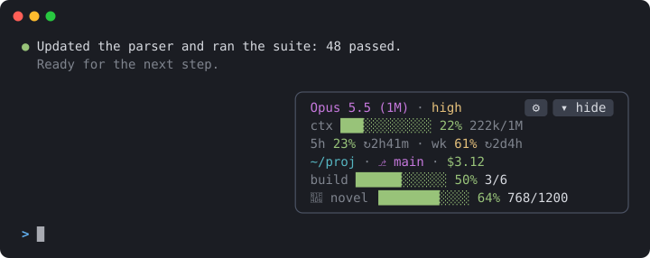
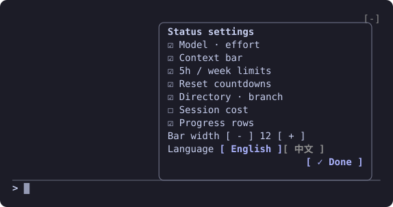
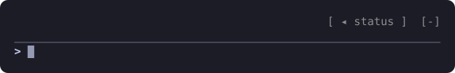

<div align="center">

# statuspane

**Claude Code 的浮动状态卡。**<br>
模型、上下文、额度、花费、分支一眼看清，能看 GitHub CI 和部署状态，还能接入任何脚本的进度条。

[](https://github.com/xuanji86/claude-statuspane/releases)
[](https://code.claude.com/docs/en/plugins/mods/overview)
[](LICENSE)

[English](README.md) · **中文**（卡片界面为英文）



</div>

## 为什么做这个

Claude Code 自带的 `statusLine` 只是 shell 脚本输出的一行文字。**statuspane** 是一个 [mod](https://code.claude.com/docs/en/plugins/mods/overview)：一张停在输入框上方的小卡片，直接读取 Claude Code 自己的会话数据，还能用鼠标点。不用写任何脚本。

## 功能

| | |
| --- | --- |
| **模型 · effort** | 当前模型和推理强度 |
| **上下文** | 进度条，加上已用 / 上限（`222k/1M`） |
| **额度** | 5 小时和每周用量，附重置倒计时（`↻2h41m`） |
| **当前位置** | 目录和 git 分支，太长会自动缩短，卡片不会被撑宽 |
| **会话花费** | 本次会话到目前为止的花费 |
| **GitHub CI** | 当前分支最新的 Actions 运行，以及推送后触发的运行，包括部署（见 [GitHub CI](#github-ci)） |
| **进度条接入** | 任何脚本或 mod 都能往卡片上加进度条，每秒刷新（见[进度接口](#进度接口)） |
| **全程鼠标** | 收起、展开、设置都是按钮 |
| **设置** | 选择要显示哪些行、进度条长度，跨会话保存 |

颜色沿用常见 statusline 的阈值：低于 60% 绿、60% 起黄、85% 起红（上下文为 50% / 80%）。

## 安装

需要 **Claude Code 2.1.287 或更高版本**（mod，即函数 hooks，从这个版本开始提供）；已在 2.1.288 上测试。mod 目前是早期功能，接口可能随版本变化，如果新版本导致卡片失效，这里会发修复版。

```text
/plugin marketplace add xuanji86/claude-statuspane
/plugin install statuspane@claude-statuspane
```

<details>
<summary>也可以在终端里安装</summary>

```sh
claude plugin marketplace add xuanji86/claude-statuspane
claude plugin install statuspane@claude-statuspane
```

</details>

终端宽度至少 70 列才会显示卡片。它只是新增，不替换任何东西：已经配置的 `statusLine` 会照常显示；只想要卡片的话，把 `~/.claude/settings.json` 里的 `statusLine` 删掉。

## 使用

<table>
<tr>
<td width="50%" valign="top">

**设置**：点 `⚙`



点某一行切换显示，`[ - ]` / `[ + ]` 调进度条长度（6–24），最后点 `✓ Done`。

</td>
<td width="50%" valign="top">

**收起**：点 `▾ hide`



右侧只留一个按钮，点 `◂ status` 展开。在输入框里输入 `/statuspane` 效果一样。

</td>
</tr>
</table>

<details>
<summary><b>提示：</b>面板角上的 <code>-</code>，以及单键快捷键</summary>

面板右上角的 `-` 是 Claude Code 自带的"隐藏插件面板"。它会把整块面板藏起来，而且只能用它的快捷键恢复（默认 `ctrl+x ctrl+a`）。如果你的终端不支持 `ctrl+x` 开头的组合键，可以在 `~/.claude/keybindings.json` 里绑到一个单键：

```json
{
  "bindings": [
    { "context": "Chat", "bindings": { "ctrl+s": "abovePrompt:toggle", "ctrl+q": "chat:stash" } }
  ]
}
```

`ctrl+s` 默认是"暂存草稿"，所以示例把它挪到了 `ctrl+q`。

</details>

## GitHub CI

设置页里有两个开关，默认都是关的。需要先装好 [GitHub CLI](https://cli.github.com) 并登录（`gh auth login`）。

| 开关 | 显示什么 |
| --- | --- |
| **CI · this branch** | 当前会话所在分支最新一次 Actions 运行：每分钟查一次，运行中每 10 秒一次 |
| **CI · after a push** | Claude 执行 `git push` 或 `gh pr merge` 后，跟踪这次触发的运行（合并则跟踪目标分支），直到跑完；结果保留 10 分钟 |

每行以 `<仓库> <分支>` 开头，后面是：

| | |
| --- | --- |
| `⟳ test · 1m20s` | 黄色：运行中，显示正在跑的 job 和已用时间 |
| `⟳ deploying · 1m20s` | 名字里带 *deploy* 的 job 正在跑 |
| `✓ deployed · 3m ago` | 绿色：跑完了，且 *deploy* job 成功（没有部署 job 时显示 `✓ passed`） |
| `✗ test failed · 3m ago` | 红色：失败的 job（或 workflow） |
| `⊘ cancelled · 3m ago` | 所有运行都被取消或跳过 |

同一个提交触发的所有 workflow 合成一行；定时（schedule）运行不算在内。

## 进度接口

任何语言写的脚本、或者别的 mod，都能把自己的进度显示在卡片上。进度行按 id 排序，最多显示 5 行；来源停止上报后会自动消失。卡片只读最近写入的 20 个文件，留在目录里的旧文件不会挤掉新的。

### 任何脚本：写一个 JSON 文件

写入 `~/.claude/statuspane/progress/<id>.json`（目录可以用 `STATUSPANE_PROGRESS_DIR` 改，须是绝对路径或以 `~/` 开头）：

```json
{ "label": "build", "percent": 42.5, "text": "3/7 · 1.2/min", "ttl": 300, "state": "running" }
```

| 字段 | 类型 | 说明 |
| --- | --- | --- |
| `label` | 字符串 | 进度条前的名字，最多 24 个字符（不填就用 id） |
| `percent` | 数字，可选 | 0–100。不填就只显示文字 |
| `text` | 字符串，可选 | 进度条后的文字，最多 60 个字符 |
| `ttl` | 秒，可选 | 文件最后一次写入后保留多久（默认 300） |
| `state` | 字符串，可选 | `running`（黄）、`ok`（绿）或 `error`（红），给进度条和文字上色 |

`<id>` 只能用字母、数字、`.`、`_`、`-`。请先写临时文件再改名覆盖，避免卡片读到写了一半的文件；删掉文件，这一行会立刻消失。

[`examples/`](examples) 里有现成的工具（会校验 id、截断超长字段并原子写入；shell 版需要 `python3`）：

```sh
examples/report-progress.sh build "build" 42.5 "3/7"            # id label [percent] [text] [ttl] [state]
```

```python
from report_progress import report, clear
report("my-job", "my job", 40, "4/10", state="running")
clear("my-job")
```

### 别的 mod：调用 `$.statuspane`

在你的 mod 的 `plugin.json` 里，把 `statuspane` 加进 `dependencies`（它的类型文件会自动放进你的 `.claude-plugin/types/statuspane/`），然后调用：

```ts
await $.statuspane.progress({ id: 'my-job', label: 'my job', percent: 40, text: '4/10', ttl: 120, state: 'running' })
await $.statuspane.clear('my-job')
```

字段和文件方式一样。通过 mod 上报的进度只存在内存里，statuspane 重新加载后需要重新上报。

### 已接入

- [**ainiee-translate**](https://github.com/xuanji86/ainiee-translate-skill) v1.14+：`progress --watch` / `--line` 会显示翻译进度。

## 隐私与安全

所有数据都留在本机。statuspane 只读取 Claude Code 自己的会话数据，在会话目录里运行 `git branch --show-current`，并读取进度目录。只有打开 CI 开关后才会联网：读取 `origin` 远程地址，用你自己登录的 `gh` 对该仓库运行 `gh run list` / `gh run view`（合并后还有 `gh pr view`）。它只读该目录里不超过 64 KB 的 `*.json` 文件，会去掉文字里的控制字符、双向控制符和零宽字符，截断每个字段的长度，不会执行文件里的任何内容。

## 开发

```sh
git clone https://github.com/xuanji86/claude-statuspane
cd claude-statuspane
claude plugin validate .
claude plugin test .
claude --plugin-dir .        # 或把目录加到 CLAUDE_CODE_PLUGIN_DIRS
```

从目录加载 mod 的会话里，每次保存文件都会自动重新加载。欢迎提 issue 和 pull request。

## 许可证

[MIT](LICENSE) © Anji Xu
